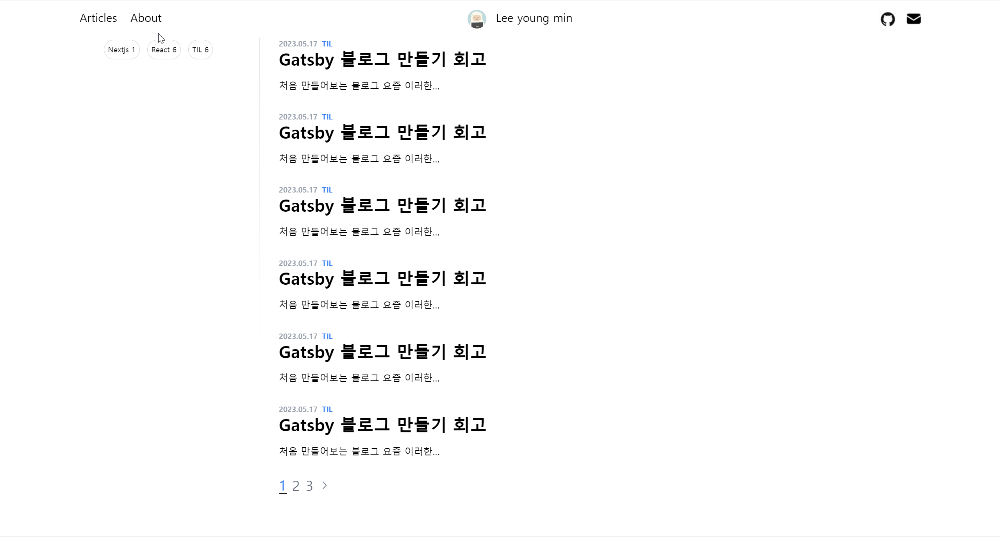

# Gatsby 블로그

## 기술스택

- Gatsby
- React
- TailwindCSS
- TypeScript

## 와이어프레임

[피그마 디자인](https://www.figma.com/file/nWZEvpohTzuExHVtIwIfGd/%EA%B0%9C%EC%B8%A0%EB%B9%84-%EB%B8%94%EB%A1%9C%EA%B7%B8?type=design&node-id=0%3A1&t=O09rsfyxLNHq1gxr-1)

## 기능

### 페이지네이션

1페이지에 6개의 글이 들어간다. 페이지별로 구분된다.
| Pagination |
|:-------------------------------:|
||

### 태그

글 각각의 태그가 있다. 이 태그별로 글을 모아볼 수 있다.
| Tags |
|:-------------------------------:|
||

### 반응형

화면의 크기에 따라 navbar와 content의 형태가 변환된다.
| Responsive |
|:-------------------------------:|
||
